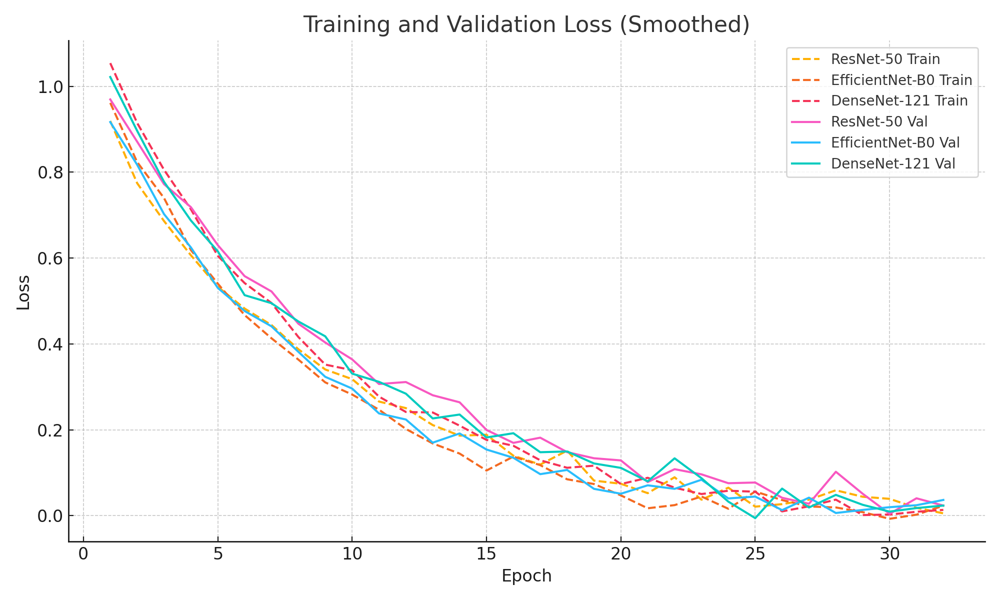
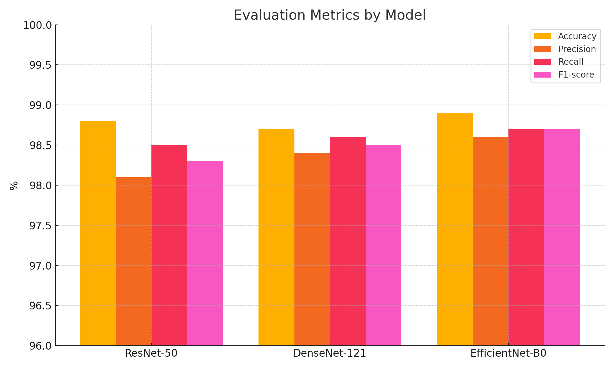

# 🦴 Bone Fracture Detection from X-ray Images using Transfer Learning

## 📌 Overview

This project presents a deep learning approach for automatic bone fracture detection in X-ray images using transfer learning.

A large dataset of approximately **40,000 radiographs** was constructed by combining multiple public datasets. Three state-of-the-art convolutional neural network architectures were fine-tuned and evaluated for binary classification (fractured vs. non-fractured).

---

## 🧠 Model Pipeline

```text
X-ray Image
    ↓
Preprocessing (Resize + Normalization)
    ↓
Data Augmentation
    ↓
Transfer Learning Models
    ↓
Binary Classification (Fractured / Not Fractured)
```

---

## ⚙️ Models Used

- ResNet-50  
- EfficientNet-B0  
- MONAI DenseNet-121  

All models were initialized with ImageNet pretrained weights and fine-tuned on the dataset.

---

## 📊 Dataset

- ~40,000 X-ray images  
- Combined from multiple Kaggle datasets and GRAZPEDWRI-DX dataset  
- Binary labels:
  - Fractured
  - Not Fractured  

Approximate distribution:
- ~18,400 fractured  
- ~22,400 non-fractured  

---

## 🧪 Training Details

- Image size: 320 × 320  
- Batch size: 256  
- Optimizer: Adam  
- Learning rate: 1e-4  
- Loss function: CrossEntropyLoss  
- Early stopping applied  

### Data Augmentation
- Random horizontal flip  
- Random rotation (±15°)  
- Brightness and contrast adjustments  

---

## 📈 Results

| Model | Accuracy | Precision | Recall | F1-score |
|------|--------|----------|--------|---------|
| ResNet-50 | 98.8% | 98.1% | 98.5% | 98.3% |
| DenseNet-121 | 98.7% | 98.4% | 98.6% | 98.5% |
| EfficientNet-B0 | **98.9%** | **98.6%** | **98.7%** | **98.7%** |

EfficientNet-B0 achieved the best overall performance.

---

## 📊 Results Visualization

### Training vs Validation Accuracy
.png)

### Training vs Validation Loss


### Model Evaluation Metrics


---

## 🛠️ Tech Stack

- Python  
- PyTorch  
- MONAI  
- OpenCV  
- NumPy  

---

## 📂 Project Structure

```text
.
├── README.md
├── wrist_fracture.ipynb
├── fracture_bone.pdf
└── results/
```

---

## 🚀 Usage

Run the notebook:

```bash
jupyter notebook wrist_fracture.ipynb
```

---

## 📄 Report

Full project report is available here:

```text
fracture_bone.pdf
```

---

## ⚠️ Limitations

- Dataset is not included  
- Model weights are not included  
- Evaluation performed on internal test set  
- External validation is required for real-world deployment  

---

## 📈 Future Work

- External dataset validation  
- Fracture localization (object detection / Grad-CAM)  
- Model deployment  
- Integration into clinical workflow  

---

## 👨‍💻 Author

Deniz Arda Yildiz  

---

## ⭐ Notes

This project demonstrates a high-performance medical imaging system for fracture detection using transfer learning, achieving near-expert level accuracy.
